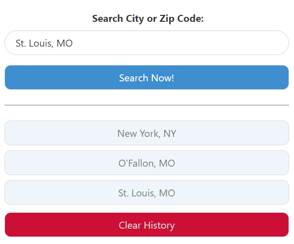

# weather-dashboard
A simple weather for checking weather data for cities

## Description
This Weather Dashboard was created to test various skills:
- Adapting to new CSS Frameworks (In this case: Bulma)
- Dynamic JavaScript
- localMemory functions
- openWeather API implimentation

It has the following features:
- Search for weather forecasts using any city name or zip code in the United States 
- Saves search history in easy to use tabs under the search bar
- Forcast cards contain graphical elements representing the projected weather and color-coded UV-Index values
- An easy to access "Clear History" button to remove items from local memory and reset your search history.
- A dynamic design that works in both desktop and mobile configurations.

## Installation
N/A

## Usage

See the published site: [here](https://stevengoldbergm.github.io/daily-planner/)
- To use the app, simply click inside your desired text entry field, write down your desired task, and tap on the floppy disc to save your data. 
- If you wish to reset the scheduler, click the "Clear Schedule" button to remove all saved data from your device.

## License
N/A
